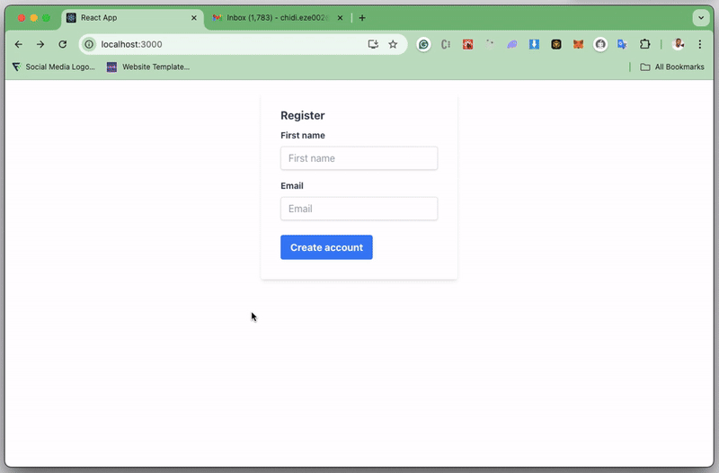

## React Real-Time Notifications Tutorial - README

This repository contains a tutorial on integrating real-time notifications into a React application. We'll explore different technologies like WebSockets, Server-Sent Events (SSE), Firebase Cloud Messaging (FCM), and Novu, allowing you to choose the best fit for your project.

### Benefits of Real-Time Notifications

- **Enhanced User Engagement:** Keep users informed with live updates, personalized messages, and critical alerts.
- **Improved User Experience:** Provide a dynamic and interactive experience, fostering real-time communication and collaboration.
- **Increased Conversion Rates:** Prompt users to take action at the right moment, boosting conversions and sales.

### Choosing the Right Technology

Several factors influence your choice of real-time technology:

- **Scalability:** Can the system handle a growing user base with high traffic?
- **Ease of Use:** Look for straightforward implementation with clear documentation and active community support.
- **Cost:** Consider your budget and expected usage to find a cost-effective solution.
- **Integration:** Ensure seamless integration with your existing tech stack.
- **Latency:** Low latency is crucial for applications requiring real-time data transmission.

### Technologies Covered

- **WebSockets:** Enables full-duplex communication between client and server, ideal for collaborative tools, online games, and financial data feeds.
- **Server-Sent Events (SSE):** A server-push technology for one-way data updates, well-suited for live updates, notifications, and data feeds.
- **Firebase Cloud Messaging (FCM):** Cloud-hosted messaging service offering real-time data synchronization and low latency.
- **Novu:** Open-source notification framework with pre-built UI components, multi-channel support (email, SMS, app notifications, chat), and scalability.

### Tutorial Structure

The tutorial is divided into sections:

1. **Setting Up a React Project:** We'll create a basic React application to demonstrate the integration.
2. **WebSockets Implementation:** Learn how to establish a WebSocket connection, send and receive messages between client and server.
3. **Firebase Cloud Messaging:** Explore integrating Firebase to send real-time notifications using FCM.
4. **Server-Sent Events (SSE):** Understand how to use SSE for server-initiated data updates in your React app.
5. **Novu Real-Time Notifications** We'll explore how to integrate Novu's notification framework into your project.

Each section provides code examples and explanations, guiding you through the implementation process.

### Getting Started

1. Clone this repository.
2. Install dependencies using `npm install`.
3. Follow the instructions in each section to implement the desired real-time notification technology.

### Additional Resources

- React: [https://react.dev/](https://react.dev/)
- WebSockets: [https://developer.mozilla.org/en-US/docs/Web/API/WebSocket](https://developer.mozilla.org/en-US/docs/Web/API/WebSocket)
- Server-Sent Events: [https://developer.mozilla.org/en-US/docs/Web/API/Server-sent_events](https://developer.mozilla.org/en-US/docs/Web/API/Server-sent_events)
- Firebase Cloud Messaging: [https://firebase.google.com/docs/cloud-messaging](https://firebase.google.com/docs/cloud-messaging)
- Novu: [https://novu.co/](https://novu.co/)
